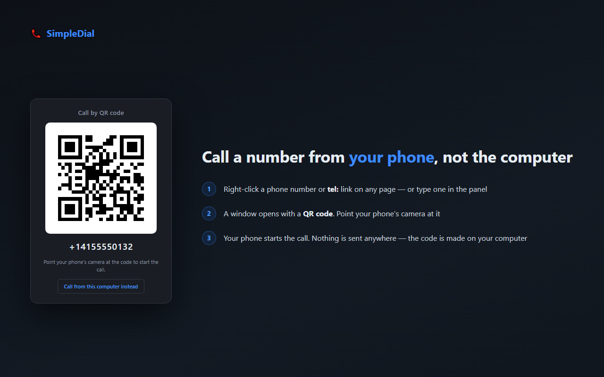

Riconosce i numeri di telefono nelle pagine web e li compone tramite l'handler
`tel:` registrato nel browser o nel sistema — oppure li mostra come **codice QR**,
da inquadrare col telefono per chiamare da lì.

**[Installa dal Chrome Web Store](https://chromewebstore.google.com/detail/simpledial/mpgblhliidfflfdofhpbhjijmncnamfk)** ·
[Codice sorgente](https://github.com/Ertagus/SimpleDial) ·
[Banco di prova](test-bench.html) ·
[Privacy policy](privacy-policy.html)

## Cosa fa

- **Tasto destro** su un link `tel:` o su un numero selezionato → voce *Chiama*
- **Codice QR**: il numero è sullo schermo del computer, la chiamata parte dal tuo telefono. Nessun accoppiamento, nessun account, nessuna app aggiuntiva.
- **Click sinistro** sui link `tel:` → opzionale, disattivo di default
- **Icona nella barra** → apre l'app telefono, oppure un pannello per digitare un numero che non è nella pagina

Puoi decidere **cosa conta come numero di telefono** con una regola configurabile, provarla dal vivo, e scegliere lo schema che il tuo softphone si aspetta: `tel:`, `callto:`, `sip:` o `skype:`.

Interfaccia in **sei lingue**: italiano, inglese, tedesco, spagnolo, francese, portoghese brasiliano.

## Cosa non fa

SimpleDial **non compone la chiamata da sé**: riconosce il numero e lo consegna all'handler che hai già registrato. Chi risponde dipende da quello.

E **non modifica mai le pagine che visiti**. Molte estensioni simili riscrivono il testo delle pagine per trasformare i numeri in link cliccabili: questa no. I numeri in chiaro si selezionano e si chiamano col tasto destro.

## Dove guardare nel codice

Il codice è pubblico. Se ti interessa vedere come funziona davvero, questi sono i punti
che rispondono alle domande più comuni:

| Domanda | Dove si vede |
|---|---|
| Contatta qualche server? | cerca `fetch`, `XMLHttpRequest`, `WebSocket`: zero occorrenze |
| Scarica codice da fuori? | no, tutti gli script sono nel pacchetto |
| Quali permessi chiede? | `storage` e `contextMenus` |
| Il QR viene da internet? | no, è costruito sul computer: nessuna immagine scaricata, nessun numero inviato |

Il pacchetto pubblicato sullo Store è in [`dist/`](https://github.com/Ertagus/SimpleDial/tree/main/dist), se vuoi confrontarlo con i sorgenti.

## Banco di prova

C'è anche una **[pagina di prova](test-bench.html)** con 52 casi: numeri in ogni formato,
link `tel:` di ogni tipo, e una serie di casi che *non devono* essere riconosciuti — prezzi,
date, codici seriali, IMEI.

Serve a due cose: verificare che l'estensione si comporti come promesso, e capire in fretta
cosa la regola di riconoscimento accetta prima di modificarla. Ogni caso dichiara il
risultato atteso, quindi si vede subito se qualcosa non torna.

---

*«QR Code» è un marchio registrato di DENSO WAVE INCORPORATED, citato in senso descrittivo.*
